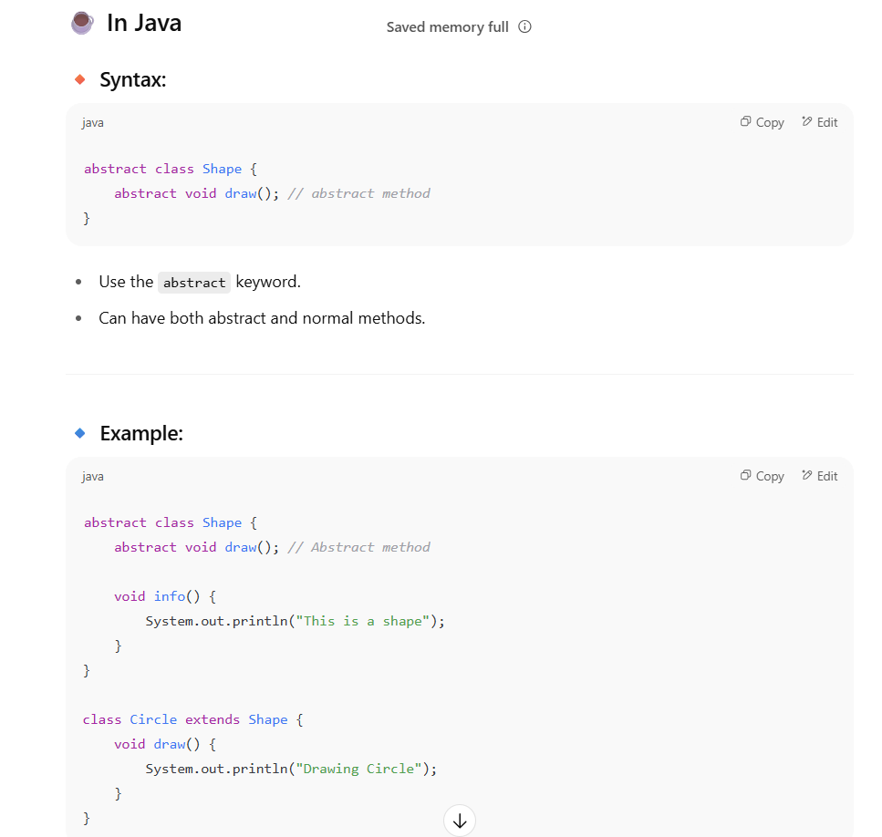
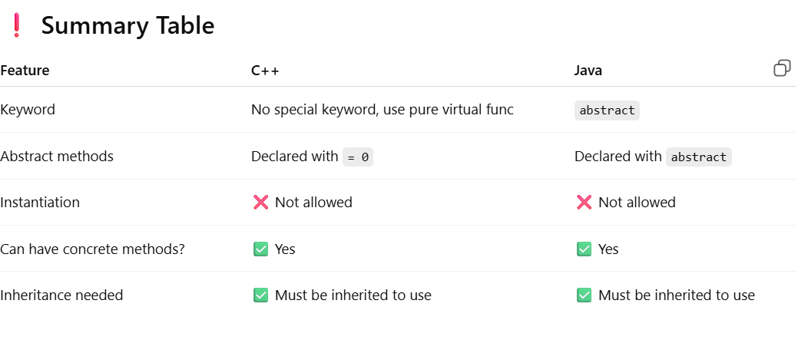
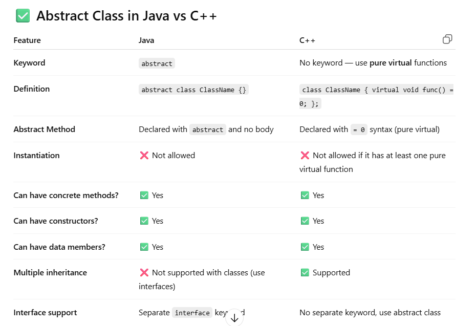
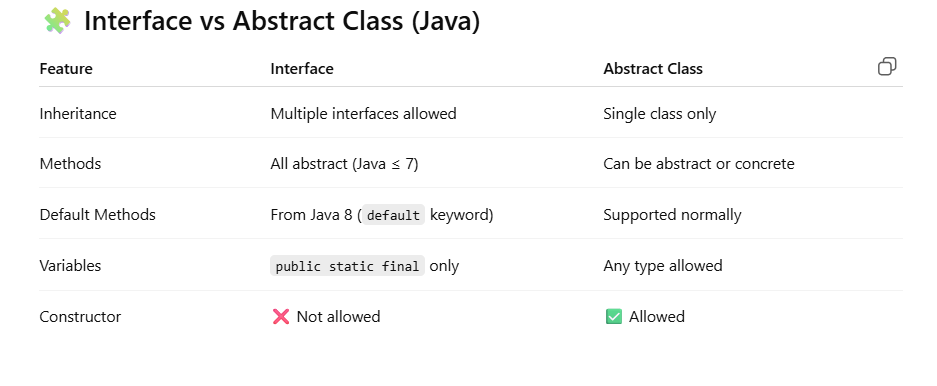
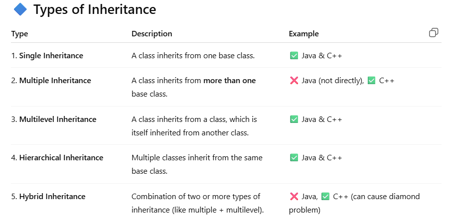
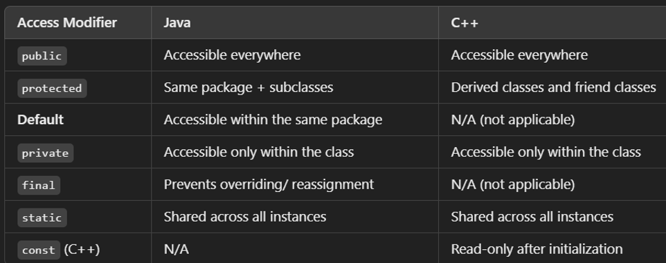
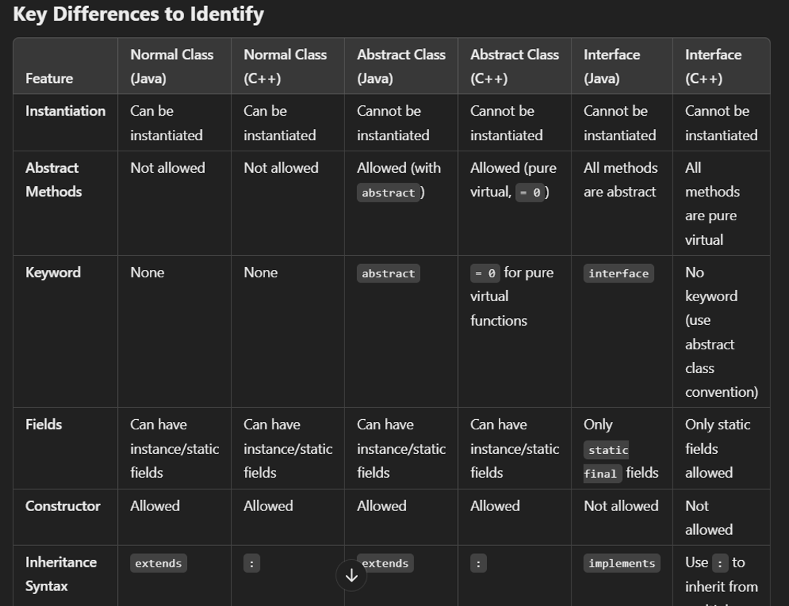
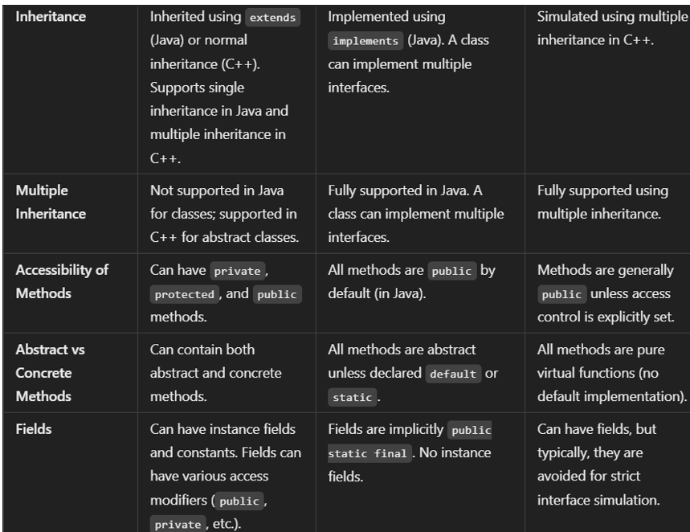

# 🌐 Tipic : Oops
## [ ] **Q1. what is oops and its key concept  ?**  
<details>
  <summary>Answer</summary> 

  # Object-Oriented Programming System (OOPs)

**OOPs** stands for **Object-Oriented Programming System**.  
It is a programming paradigm that uses **"objects"** to model real-world entities. Each object contains **data (attributes)** and **functions (methods)** to operate on that data.

---

## 🔑 Key Concepts of OOPs

| Concept           | Description |
|-------------------|-------------|
| **Class**         | A blueprint or template for creating objects. |
| **Object**        | An instance of a class that contains real values. |
| **Encapsulation** | Binding data and methods into a single unit and hiding the internal details. |
| **Abstraction**   | Showing only essential features and hiding the complex implementation. |
| **Inheritance**   | One class can acquire the properties and methods of another class. |
| **Polymorphism**  | Same function behaves differently in different contexts (overloading/overriding). |

---

## ✅ Benefits of OOP

- Reusability through inheritance
- Increased modularity
- Easy maintenance and debugging
- Secure code via encapsulation
- Models real-world entities effectively

---
</details>

---
## [ ] **Q2. what are 4 pillars of Oops  ?**  
<details>
  <summary>Answer</summary> 

  # 🧱 4 Pillars of Object-Oriented Programming (OOP)

## 1. Encapsulation
- **Definition:** Wrapping data (variables) and code (methods) into a single unit (class), and restricting direct access to some of the object's components.
- **Goal:** Hide internal details and protect data.

### ✅ Example (C++)
```cpp
class Student {
private:
    int marks;   // private data, cannot be accessed directly

public:
    void setMarks(int m) {
        if (m >= 0 && m <= 100)
            marks = m;
    }

    int getMarks() {
        return marks;
    }
};
```
## 2. Abstraction

**Definition:** Showing only relevant information and hiding unnecessary details.

**Goal:** Simplify complexity.

### ✅ Example (C++)

```cpp
class Car {
public:
    void drive() {
        // User only needs to know 'drive', not internal engine logic
        startEngine();
        moveForward();
    }

private:
    void startEngine() { /* ... */ }
    void moveForward() { /* ... */ }
};
```
## 3. Inheritance

**Definition:** A class (child) can inherit properties and methods from another class (parent).

**Goal:** Code reuse.

### ✅ Example (C++)

```cpp
#include <iostream>
using namespace std;

class Animal {
public:
    void eat() {
        cout << "Eating..." << endl;
    }
};

class Dog : public Animal {
public:
    void bark() {
        cout << "Barking..." << endl;
    }
};
```
## 4. Polymorphism

**Definition:** Same function behaves differently in different classes or contexts.

### Types:

- **Compile-time Polymorphism** (Function Overloading ,operator oveloading)
- **Run-time Polymorphism** (Function Overriding)

---

### ✅ Example 1: Function Overloading (Compile-time)

```cpp
#include <iostream>
using namespace std;

class Print {
public:
    void show(int a) {
        cout << "Integer: " << a << endl;
    }
    void show(string s) {
        cout << "String: " << s << endl;
    }
};
```
## ✅ Example 2: Function Overriding (Run-time)
```cpp
#include <iostream>
using namespace std;

class Animal {
public:
// Enable runtime polymorphism in c++ in it is by default
    virtual void sound() {

        cout << "Animal sound" << endl;
    }
};

class Cat : public Animal {
public:
    void sound() override {
        cout << "Meow" << endl;
    }
};
```
</details>

---
## [ ] **Q3. What is abstract class ?**  
<details>
  <summary>Answer</summary> 
  # 🧠 What is an Abstract Class?

An **abstract class** is a class that **cannot be instantiated directly** and is meant to be **inherited** by other classes.  
It serves as a **blueprint** for derived classes.

---

## 🔹 Features of Abstract Class

- Can have **abstract methods** (pure virtual functions) — methods without a body.
- Can have **concrete methods** (fully implemented functions).
- Used to **enforce a structure** for derived/subclasses.
- Supports **code reuse** by implementing shared functionality.

---

## ✅ In C++

### 🔸 Syntax:
```cpp
#include <iostream>
using namespace std;

class Shape {
public:
    virtual void draw() = 0; // Abstract method
};

class Circle : public Shape {
public:
    void draw() override {
        cout << "Drawing Circle" << endl;
    }
};

```


 

</details>

---

## [ ] **Q4. Every abstract class should must have abstract method? True or False  ?**  
<details>
  <summary>Answer</summary> 
  🧠 Explanation:
An abstract class does NOT have to contain an abstract method — but if a class does have at least one abstract method, then it must be declared abstract.
</details>

---

## [ ] **Q5. Every abstract method (pure virtual method) must be implemented in the child class,  ?**  
<details>
  <summary>Answer</summary> 

  
</details>

---

## [ ] **Q6. Abstract class in java vs c++  ?**  
<details>
  <summary>Answer</summary> 

  - In C++, if a class contains at least one pure virtual function, then:

- It becomes an abstract class.

- It cannot be instantiated — meaning you cannot create an object of that class.

  
</details>

---

## [ ] **Q7: Can an abstract class and Interface have constructors  ?**  
<details>
  <summary>Answer</summary> 


- Yes. Abstract classes can have constructors, which are called when a subclass object is created. This helps in initializing common data members.

- Interface — No, it cannot have constructors.
</details>

---

## [ ] **Q8. Can a subclass skip implementing abstract methods?  ?**  
<details>
  <summary>Answer</summary> 
Only if the subclass is also declared as abstract. Otherwise, it must override all abstract methods.
</details>

---


## [ ] **Q9. Why use an abstract class if it doesn't have any abstract method ?**  
<details>
  <summary>Answer</summary> 
To prevent instantiation of the base class.

To enforce inheritance-based design.

To provide shared behavior while forcing subclass-specific implementation later.

For semantic clarity in API design.


</details>

---

## [ ] **Q10. What is interface  ?**  
<details>
  <summary>Answer</summary>

  - An interface cannot be instantiated.

   
</details>

---

## [ ] **Q11. In interface it is necessary to overide all method ?**  
<details>
  <summary>Answer</summary> 
  ✅ Yes, it is necessary to override all methods of an interface in the implementing class, unless:

- The class is declared abstract.

- The interface contains default or static methods (Java 8+), which don’t need to be overridden.
</details>

---

## [ ] **Q12. In an Abstract Class, Should All Methods Be Overridden?  ?**  
<details>
  <summary>Answer</summary> 
  No — only abstract methods must be overridden.
</details>

---

## [ ] **Q13. What is final and static key word  ?**  
<details>
  <summary>Answer</summary> 

  
  

  - Means every object keliye new vriable create nahi hoga memory me .

  
</details>

---

## [ ] **Q14. Explain Virtual Keyword  ?**  
<details>
  <summary>Answer</summary> 
    
The 'virtual' keyword in C++ is used for creating virtual functions to enable runtime polymorphism.

</details>

---

## [ ] **Q15. Explain Operator Overloading  ?**  
<details>
  <summary>Answer</summary> 

  Operator Overloading means giving additional meaning to an existing operator (like +, -, ==, etc.) so it can be used with user-defined data types (like classes or structs).

✅ It allows you to use operators on objects, just like you use them on built-in types.

```cpp
#include <iostream>
using namespace std;

class Complex {
private:
    float real;
    float imag;

public:
    // Constructor
    Complex(float r = 0, float i = 0) {
        real = r;
        imag = i;
    }

    // Overloading the + operator
    Complex operator+(const Complex& other) {
        return Complex(real + other.real, imag + other.imag);
    }

    // Display function
    void display() {
        cout << real << " + " << imag << "i" << endl;
    }
};

int main() {
    Complex c1(3.5, 2.5);
    Complex c2(1.5, 4.5);

    Complex sum = c1 + c2;  // Calls overloaded + operator

    cout << "Sum: ";
    sum.display();

    return 0;
}
```

</details>

---

## [ ] **Q16. Can we define methods as private in Interface  ?**  
<details>
  <summary>Answer</summary> 

  No, all methods in an interface are implicitly public.
</details>


---

## [ ] **Q17. Type of inheritence ?**  
<details>
  <summary>Answer</summary> 


  

  -  Yes, in Java, multiple inheritance is possible through interfaces
</details>

---

## [ ] **Q18.Can Polymorphism work without Inheritance  ?**  
<details>
  <summary>Answer</summary> 

  No, polymorphism relies on inheritance to allow an object of a derived class to be treated as an instance of a base class.
</details>

---

## [ ] **Q19. Why simple base class cannot replace Abstract Classes? ?**  

<details>
  <summary>Answer</summary> 
  A base class may provide complete methods, whereas abstract classes force the implementation of specific methods in derived classes.
</details>

---

## [ ] **Q20.Explain Interface Segregation Principle?  ?**  
<details>
  <summary>Answer</summary> 

  This principle states that clients should not be forced to implement interfaces they do not use.
</details>

---

## [ ] **Q21. Can We Do Multiple Inheritance with:Normal class , Abstract Class ,interface ?**  
<details>
  <summary>Answer</summary> 
  
</details>

---

## [ ] **Q22. Can non-abstract method be overriden  ?**  
<details>
  <summary>Answer</summary> 

  
</details>

---

## [ ] **Q23. Acess Modifier  ?**  
<details>
  <summary>Answer</summary> 

  
</details>

---

## [ ] **Q24. How you can identify the normal class , abstract class , interference in cpp and java  ?**  
<details>
  <summary>Answer</summary> 

  
</details>

---

## [ ] **Q25. Difference in abstract class and interface?  ?**  
<details>
  <summary>Answer</summary> 

  
  
</details>

---

## [ ] **Q26. Can an abstract class or interface have static methods?**  
<details>
  <summary>Answer</summary>

- **Java (Abstract Class)**: ✅ Yes, abstract classes can have static methods.  
- **Java (Interface)**: ✅ Yes, since Java 8, interfaces can have static methods.  
- **C++ (Abstract Class)**: ✅ Yes, abstract classes can have static methods.

</details>  

---

## [ ] **Q27. Can abstract classes or interfaces be nested?**  
<details>
  <summary>Answer</summary>

- **Java**: ✅ Yes, abstract classes and interfaces can be nested inside other classes or interfaces.  
- **C++**: ✅ Yes, abstract classes can be nested within other classes.

</details>  

---

## [ ] **Q28. Can interfaces extend other interfaces?**  
<details>
  <summary>Answer</summary>

- **Java**: ✅ Yes, interfaces can extend other interfaces (single or multiple).

</details>  

---

## [ ] **Q29. Can an abstract class or interface extend a concrete class?**  
<details>
  <summary>Answer</summary>

- **Java (Abstract Class)**: ✅ Yes, an abstract class can extend a concrete class.  
- **Java (Interface)**: ❌ No, an interface cannot extend a concrete class.  
- **C++**: ✅ Yes, an abstract class can inherit a concrete class.

</details>  

---

## [ ] **Q30. Can an abstract class or interface have instance variables?**  
<details>
  <summary>Answer</summary>

- **Java (Abstract Class)**: ✅ Yes, it can have instance variables.  
- **Java (Interface)**: ❌ No, interfaces can only have constants (`public static final`).  
- **C++ (Abstract Class)**: ✅ Yes, they can have instance variables.

</details>  

---

## [ ] **Q31. Can an abstract class or interface be `final`?**  
<details>
  <summary>Answer</summary>

- **Java (Abstract Class)**: ❌ No. `final` prevents inheritance, which is required for abstract classes.  
- **Java (Interface)**: ❌ No. Interfaces cannot be declared `final`.  
- **C++ (Abstract Class)**: ❌ No. A `final` class cannot be inherited, which contradicts the purpose of abstract classes.

</details> 

---

## [ ] **Q32. Can an abstract class or interface inherit another class or interface?**  
<details>
  <summary>Answer</summary>

- **Java (Abstract Class)**: ✅ Yes, it can extend another class (abstract or concrete).  
  ```java
  abstract class A {}
  abstract class B extends A {}

  ```
  </details>

  ---

