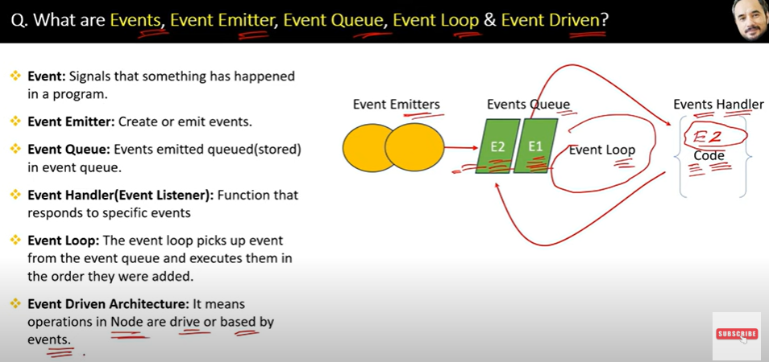
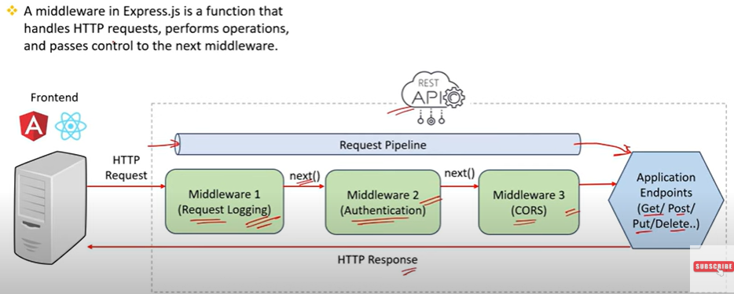
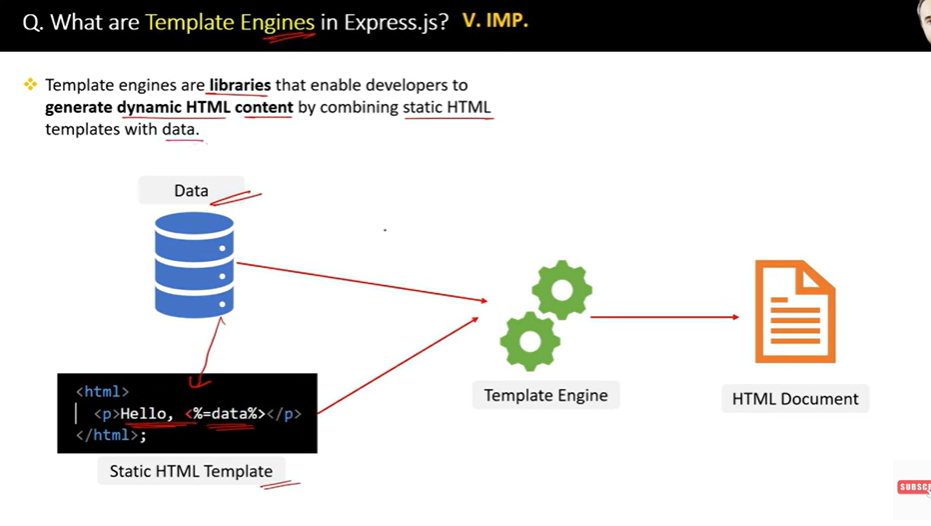
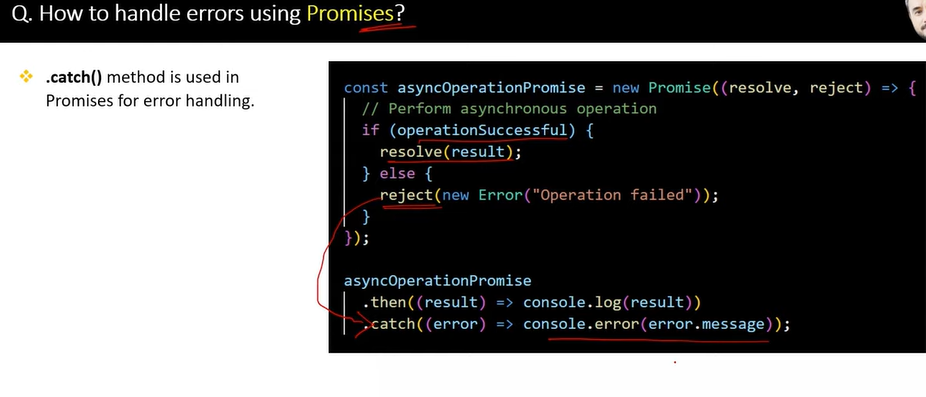

## 🔹 Topic:  Node.js-Basics

- [ ] **Q1. What is Node.js?**  
<details>
  <summary>Answer</summary>
  
  Node.js is:
  1. **JavaScript Runtime Environment**: It allows JavaScript code to run **outside of a web browser**, mainly on the **server side**.
  
  3. **Built on V8 Engine**: Uses **Google Chrome’s V8** engine to compile JavaScript to machine code for high performance.
  
  4. **Event-driven Architecture**: Handles operations through **events and callbacks**, making it suitable for asynchronous programming.
  
  5. **Non-blocking I/O Model**: Performs I/O operations (like reading from a database or file system) without blocking the main thread.
  
  6. **Single-threaded but Scalable**: Uses a **single-threaded event loop** to manage many client connections efficiently.
  
   
  
</details>


 - [ ] **Q2. What is the difference between Runtime Environment & Framework?**  
<details>
  <summary>Answer</summary>
  
  **Runtime Environment** vs **Framework**:

  - **Runtime Environment**:
    - Provides the infrastructure for code execution.
    - Handles low-level operations like **memory management**, **input/output**, and **thread handling**.
    - Example: **Node.js**, **JVM (Java Virtual Machine)**.

  - **Framework**:
    - Provides a **structured set of tools, libraries, and guidelines** to simplify application development.
    - Offers **predefined code**, design patterns, and **best practices** to speed up development.
    - Example: **Express.js**, **React**, **Angular**, **Spring**.

</details>

- [ ] **Q3. What are difference between client-side and server-side?**  
<details>
  <summary>Answer</summary>

   
  
</details>


## 🔹 Topic: Main Features of Node.js

- [ ] **Q1. What is 7 main features of Node.js**  
<details>
  <summary>Answer</summary>
  
  
   
  
</details>
 
- [ ] **Q2. What is a single threaded programming?**  
<details>
  <summary>Answer</summary>
  
  
  - Single-threaded programming is a programming model where only one task or instruction is executed at a time in a single flow of control. This means all operations are handled sequentially, using a single thread of execution. In this model, the program cannot perform multiple operations simultaneously. While it simplifies debugging and understanding the program flow, it can lead to performance issues if long-running tasks block the thread. JavaScript (and Node.js) uses a single-threaded model with the help of an event loop and asynchronous callbacks to handle multiple operations without blocking the main thread.
  
</details>

- [ ] **Q3. What is Synchronous Programming?**  
<details>
  <summary>Answer</summary>
  
  
 -   In a synchronous program, each task is performed one after the other, and the program waits for each operation to complete before moving on to the next one.
- Synchronous programming focuses on the order of execution in a sequential manner, while single-threaded programming focuses on the single thread.
  
</details>

- [ ] **Q3. What is Asynchronous Programming?**  
<details>
  <summary>Answer</summary>
  
  
 
</details>

- [ ] **Q4. “If Node.js is single-threaded, how does it handle multiple asynchronous operations?”**  
<details>
  <summary>Answer</summary>
  “Although Node.js is single-threaded for running JavaScript, it achieves concurrency through the event loop and libuv's thread pool (liberary of c++). When async operations like file I/O or API calls are made, Node offloads them to libuv, which handles them in background threads. Once they’re done, the event loop places their callbacks into the queue, and they’re executed when the main thread is free. This architecture allows Node.js to remain non-blocking and efficient, even while handling many asynchronous tasks simultaneously.”

  -  3. The Event Loop Handles Scheduling
The event loop keeps checking if the main thread is free.

When an asynchronous task (like file read) finishes, its callback is queued.

Once the call stack is empty, the event loop picks up the callback and executes it.
  
-4. Thread Pool for Background Operations
Libuv maintains a thread pool (default size = 4) for executing blocking operations in parallel outside the main thread.

This allows Node.js to be non-blocking and efficient, even for tasks like reading large files or compressing data.  
  
 
</details>


- [ ] **Q4. What is event,event emmitter,event queue, event loop and event driven?**
<details>
<summary>Answer</summary>


</details>

- [ ] **Q5. what are the main featere and advantages of node?**
<details>
<summary>Answer</summary>


</details>

- [ ] **Q6. what are disadvantages node?**
<details>
<summary>Answer</summary>

 

</details>

- [ ] **Q6. How to export and import module for single and multiple function?**
<details>
<summary>Answer</summary>

  

</details>

- [ ] **Q6. what is module wrapper function?**
<details>
<summary>Answer</summary>

   “In Node.js, every module is wrapped inside a function called the Module Wrapper Function. It provides scope isolation and injects useful arguments like exports, require, module, __filename, and __dirname. This design allows Node to implement its CommonJS module system and prevent global namespace pollution.”
   


</details>

- [ ] **Q6. what are modules, type of modules and give few exmple fo built inmodule?**
<details>
<summary>Answer</summary>
A module in Node.js is a reusable block of code whose existence doesn’t pollute the global scope. It can export functions, objects, classes, or variables, and be imported in other files.

-  Modules help break large applications into smaller, manageable parts.


</details>

## 🔹 Topic: Express

- [ ] **Q1. What are advantages of using express with node?**
<details>
<summary>Answer</summary>

“Express.js is a fast, minimal, and flexible web framework built on top of Node.js. It simplifies backend development by providing a clean API for routing, middleware, and error handling. Express is widely used to build RESTful APIs and web applications, and it significantly reduces boilerplate code compared to using Node’s built-in http module.”


</details>

- [ ] **Q2 How to create serve with express and without express?**

<details>
<summary>Answer</summary>


</details>


- [ ] **Q2  What is Middleware in Express.js and when to use them??**

<details>
<summary>Answer</summary>



# 🚀 Express Middleware Cheat Sheet

| Middleware                          | Explanation                                                                 |
|-------------------------------------|-----------------------------------------------------------------------------|
| `app.use(express.json())`           | Parses incoming JSON payloads (used in APIs to handle POST/PUT JSON data). |
| `app.use(express.urlencoded({ extended: true }))` | Parses URL-encoded data (like form submissions). `extended: true` supports nested objects. |
| `app.use(cors())`                   | Enables Cross-Origin Resource Sharing (lets frontend access backend on a different domain/port). |
| `app.use(helmet())`                 | Sets various HTTP headers to secure the app (prevents attacks like clickjacking, sniffing). |
| `app.use(xss())`                    | Sanitizes user input to prevent Cross-Site Scripting (XSS) attacks.        |
| `app.use(hpp())`                    | Protects against HTTP Parameter Pollution (blocks duplicate query params). |
| `app.use(morgan('dev'))`            | Logs HTTP requests in the console (method, URL, status code, response time). |
| `app.use(limiter)`                  | Applies rate limiting to prevent API abuse (limits requests per IP).       |
| `app.use(cookieParser())`           | Parses cookies from the request header (used for session/authentication).  |


 
</details>

- [ ] **Q2 what is  app.use() and next in respect of middleware ?**

<details>
<summary>Answer</summary>
"app.use() is used to add middleware to my app. Middleware is like a layer that can modify the request or check something before sending a response. Inside it, I use next() to pass control to the next middleware or route. Without calling next(), the app would hang."
 
</details>


- [ ] **Q2 How to implement specfic middleware for groups of routes  ?**


<details>
<summary>Answer</summary>

"app.use('/path', middleware) is used when I want the middleware to run only for a group of routes that start with that path. It’s very useful for grouping protected routes like /admin or /api."
 
</details>

- [ ] **Q2 What is the Request Pipeline in Express ?**

<details>
<summary>Answer</summary>
"The request pipeline in Express is the sequence of middlewares and route handlers that a request passes through. Each middleware can process the request, modify it, or pass it along using next(). This makes Express highly modular and flexible."

Client Request ⟶ Middleware 1 ⟶ Middleware 2 ⟶ Route Handler ⟶ Response

 
</details>

- [ ] **Q2 What is error handling middleware and how to implement it  ?**

<details>
<summary>Answer</summary>
 
 
 
</details>

 
- [ ] **Q2 if you have 5 middleware then in which middleware you will do error handleing?**

<details>
<summary>Answer</summary>
 i will do errorhandling in last middleware because if error came to any middleware  then it look next remaiming middleware that which one has written err in argumant .
 if there is error occur in any middleware then it will directly jump forward to middleware that is doing error handling .
 
</details>

- [ ] **Q3 what is built in middleware and how to serve static file from express**
<details>
<summary>Answer</summary>


</details>

- [ ] **Q4 What are thirparty middleware give some example  ?**

<details>
<summary>Answer</summary>


 
</details>

- [ ] **Q5 All the types of middleware  ?**
 

<details>
<summary>Answer</summary>

 

 
</details>

- [ ] **Q6. what are Advantage of using middleware in expresss  ?**

<details>
<summary>Answer</summary>

 
</details>

- [ ] **Q7 what is routing in express  ?**

<details>
<summary>Answer</summary>


 
</details>

- [ ] **Q8 what is diff in routing and middleware in express  ?**

<details>
<summary>Answer</summary>


 
</details>

- [ ] **Q9 How to implement routig in express  ?**


<details>
<summary>Answer</summary>


 
</details>

- [ ] **Q10 How to handle route in real application ?**

<details>
<summary>Answer</summary>


 
</details>

- [ ] **Q11 what are routes parameter  ?**

<details>
<summary>Answer</summary>


 
</details>

- [ ] **Q12 What are router object  and  router method and how to implement it ?**

<details>
<summary>Answer</summary>


 
</details>

- [ ] **Q13 what is diff bwn app.get() and router.get()  ?**

<details>
<summary>Answer</summary>


 
</details>

- [ ] **Q14 What is Route Chaining in Express?**

<details>
<summary>Answer</summary>

Route chaining in Express.js means attaching multiple HTTP methods (GET, POST, PUT, DELETE, etc.) to the same route path, one after another, using dot chaining syntax.

``` javascript

 app.route('/path')
  .get((req, res) => { ... })
  .post((req, res) => { ... })
  .put((req, res) => { ... })
  .delete((req, res) => { ... });
  
  ```

- Otherway
 ``` javascript

 const express = require("express");
const router = express.Router();

// Route chaining for /users
router.route("/users")
  .get((req, res) => {
    res.send("📦 Get all users");
  })
  .post((req, res) => {
    res.send("📦 Create a new user");
  });

// Route chaining for /users/:id
router.route("/users/:id")
  .get((req, res) => {
    res.send(`📦 Get user with ID ${req.params.id}`);
  })
  .put((req, res) => {
    res.send(`📦 Fully update user ${req.params.id}`);
  })
  .patch((req, res) => {
    res.send(`📦 Partially update user ${req.params.id}`);
  })
  .delete((req, res) => {
    res.send(`📦 Delete user ${req.params.id}`);
  });

module.exports = router;


```
- [ ] **Q15 what is Route nesting  ?**

<details>
<summary>Answer</summary>


 
</details>
 
</details>

## 🔹 Topic: Code implemantaion
- [ ] **Q1. Write all the diff http method of api calling and handling   ?**

<details>
<summary>Answer</summary>

```javascript

const express = require("express");
const cors = require("cors");
const app = express();
const PORT = 3001;

app.use(cors());
app.use(express.json());

let users = [
  { id: 1, name: "Himanshu", role: "Student" },
  { id: 2, name: "Manish", role: "Mentor" },
];


// ---------------- GET (No Params) ----------------
// 📌 Get all users
// ➤ Route: GET /api/users
app.get("/api/users", (req, res) => {
  res.json(users);
});


// ---------------- GET with Query ----------------
// 📌 Get users filtered by role
// ➤ Route: GET /api/users/filter?role=Student
app.get("/api/users/filter", (req, res) => {
  const role = req.query.role;
  const filtered = users.filter(user => user.role === role);
  res.json(filtered);
});


// ---------------- GET with Route Params ----------------
// 📌 Get a specific user by ID
// ➤ Route: GET /api/users/:id
app.get("/api/users/:id", (req, res) => {
  const id = parseInt(req.params.id);
  const user = users.find(u => u.id === id);
  res.json(user || { message: "User not found" });
});


// ---------------- POST ----------------
// 📌 Create a new user
// ➤ Route: POST /api/users
// ➤ Body: { name: "Anjali", role: "Admin" }
app.post("/api/users", (req, res) => {
  const { name, role } = req.body;
  const newUser = { id: Date.now(), name, role };
  users.push(newUser);
  res.json({ message: "User added", user: newUser });
});


// ---------------- PUT ----------------
// 📌 Fully update a user (replace name and role)
// ➤ Route: PUT /api/users/:id
// ➤ Body: { name: "New Name", role: "New Role" }
app.put("/api/users/:id", (req, res) => {
  const id = parseInt(req.params.id);
  const { name, role } = req.body;
  users = users.map(u => (u.id === id ? { id, name, role } : u));
  res.json({ message: "User fully updated" });
});


// ---------------- PATCH ----------------
// 📌 Partially update a user (only specific fields)
// ➤ Route: PATCH /api/users/:id
// ➤ Body: { name: "OnlyName" } or { role: "OnlyRole" }
app.patch("/api/users/:id", (req, res) => {
  const id = parseInt(req.params.id);
  users = users.map(u => {
    if (u.id === id) {
      return { ...u, ...req.body }; // Merge fields
    }
    return u;
  });
  res.json({ message: "User partially updated" });
});


// ---------------- DELETE ----------------
// 📌 Delete a user by ID
// ➤ Route: DELETE /api/users/:id
app.delete("/api/users/:id", (req, res) => {
  const id = parseInt(req.params.id);
  users = users.filter(u => u.id !== id);
  res.json({ message: "User deleted" });
});


// ---------------- Start Server ----------------
app.listen(PORT, () => {
  console.log(`✅ Backend running at http://localhost:${PORT}`);
});
```

- **Frontend**

 ```javascript
 import React, { useState } from "react";
import axios from "axios";

const API_URL = "http://localhost:3001/api/users";

function App() {
  const [response, setResponse] = useState("");

  // 🔹 GET all users
  const getAllUsers = async () => {
    const res = await axios.get(API_URL);
    setResponse(JSON.stringify(res.data, null, 2));
  };

  // 🔹 GET users by query (?role=Student)
  const getByQuery = async () => {
    const res = await axios.get(`${API_URL}/filter?role=Student`);
    setResponse(JSON.stringify(res.data, null, 2));
  };

  // 🔹 GET user by ID (route param)
  const getById = async () => {
    const res = await axios.get(`${API_URL}/1`);
    setResponse(JSON.stringify(res.data, null, 2));
  };

  // 🔹 POST a new user
  const addUser = async () => {
    const res = await axios.post(API_URL, {
      name: "Anjali",
      role: "Admin"
    });
    setResponse(JSON.stringify(res.data, null, 2));
  };

  // 🔹 PUT - full update
  const updateUserFully = async () => {
    const res = await axios.put(`${API_URL}/1`, {
      name: "Himanshu Kumar",
      role: "Engineer"
    });
    setResponse(JSON.stringify(res.data, null, 2));
  };

  // 🔹 PATCH - partial update
  const updateUserPartially = async () => {
    const res = await axios.patch(`${API_URL}/1`, {
      role: "Senior Engineer"
    });
    setResponse(JSON.stringify(res.data, null, 2));
  };

  // 🔹 DELETE user by ID
  const deleteUser = async () => {
    const res = await axios.delete(`${API_URL}/2`);
    setResponse(JSON.stringify(res.data, null, 2));
  };

  return (
    <div style={{ padding: "20px" }}>
      <h2>React + Axios CRUD Example</h2>

      <button onClick={getAllUsers}>GET All Users</button>
      <button onClick={getByQuery}>GET by Query</button>
      <button onClick={getById}>GET by Param</button>
      <button onClick={addUser}>POST</button>
      <button onClick={updateUserFully}>PUT</button>
      <button onClick={updateUserPartially}>PATCH</button>
      <button onClick={deleteUser}>DELETE</button>

      <pre style={{ marginTop: "20px", background: "#f1f1f1", padding: "10px" }}>
        {response}
      </pre>
    </div>
  );
}

export default App;
```


</details>


## 🔹 Topic: Template Engines in Express.js


- [ ] **Q16 What is template engine libraries name few of them and emplement any of them  ?**

<details>
<summary>Answer</summary>




</details>


## 🔹 Topic: Rest api Basics

- [ ] **Q1 what is Rest and Restfull api and Tell the 5 Rest guidlines ?**

<details>
<summary>Answer</summary>


# 🌐 REST Guidelines (Principles of RESTful API Design)

REST stands for **Representational State Transfer**.  
It is an **architectural style** used to design **web APIs** that are scalable, stateless, and maintainable.

---

## 📏 REST Architectural Guidelines

---

### 1. 📍 Client–Server Architecture

- Frontend (client) and backend (server) should be **separated**.
- Client handles UI/UX; server handles logic and database.

```txt
Why? => Enables independent development and scaling.
```

---

### 2. 📍 Statelessness

- Each request from the client must have **all the data needed**.
- Server **does not store session info** or client state between requests.

```txt
Why? => Makes APIs easier to scale and debug.
```

---

### 3. 📍 Cacheable

- Server responses should indicate if they can be **cached**.
- Use headers like `Cache-Control` to define caching behavior.

```txt
Why? => Improves performance by reducing redundant requests.
```

---

### 4. 📍 Uniform Interface

> A consistent and standard way to structure the API.

- **Resources** are identified via URIs (`/users`, `/products/1`)
- Use **standard HTTP methods**: `GET`, `POST`, `PUT`, `PATCH`, `DELETE`
- **Self-descriptive messages**: Everything needed is in request (headers, body)
- **Stateless interactions**

```txt
Why? => Simpler, consistent, and more predictable API design.
```

---

### 5. 📍 Layered System

- The system may include **proxies, gateways, or authentication layers**.
- The client **does not need to know** whether it is connected to the main server or a middle layer.

```txt
Why? => Adds flexibility, scalability, and security.
```

---

### 6. 📍 Code on Demand (Optional)

- The server can send **executable code (e.g. JavaScript)** to the client.
- **Rarely used** in practice.

```txt
Why? => Offers more functionality, but reduces visibility/debugging.
```

---

## ✅ REST Methods Summary

| Method   | Purpose                 | Example                |
|----------|-------------------------|------------------------|
| `GET`    | Read data               | `/users`, `/users/1`  |
| `POST`   | Create new resource     | `/users`              |
| `PUT`    | Full update             | `/users/1`            |
| `PATCH`  | Partial update          | `/users/1`            |
| `DELETE` | Delete resource         | `/users/1`            |

---

## 🧠 When Is an API RESTful?

✅ If it follows all the rules above:
- Stateless
- Uses standard HTTP methods
- Proper URLs (nouns, not verbs)
- Client-server separation
- Optional: cacheable, layered system, code on demand


 
</details>

- [ ] **Q2 What are Http request and response structures in Ui and REST api  ?**

<details>
<summary>Answer</summary>


 
</details>

- [ ] **Q3 What is differance between Rest api and Soap api  ?**

<details>
<summary>Answer</summary>


 
</details>

- [ ] **Q5 What is http method and and https verbs list them ?**

<details>
<summary>Answer</summary>


 
</details>


- [ ] **Q5 what is diff in put and patch method  ?**

<details>
<summary>Answer</summary>
PUT replaces the entire resource with the new data.

PATCH updates only the specified fields of the resource.

 
</details>

- [ ] **Q6 Explain the concept of idempotance in Rest api  ?**

<details>
<summary>Answer</summary>


 
</details>

- [ ] **Q7 Explain the status code  ?**

<details>
<summary>Answer</summary>


 
</details>

- [ ] **Q8 Explain Cors is detail  ?**

<details>
<summary>Answer</summary>

# 🛡️ CORS in Express.js

## 🌐 What is CORS?

**CORS** stands for **Cross-Origin Resource Sharing**.  
It's a **security feature** enforced by browsers to restrict web apps from making requests to a **different origin/domain** than the one the app was loaded from.

---

## ❌ Example Problem

Your frontend app runs on:
```
http://localhost:3000
```

Your backend API runs on:
```
http://localhost:3001
```

If you try to fetch data from React to Express, the browser blocks the request due to CORS policy.

---

## ✅ Solution: Use `cors` Middleware in Express

### Step 1: Install the package

```bash
npm install cors
```

---

### Step 2: Allow All Origins (Remove All Restrictions)

```js
const cors = require("cors");
const express = require("express");

const app = express();

app.use(cors()); // Allows all origins
```

---

### Step 3: Allow Only Specific Origin

```js
app.use(cors({
  origin: "http://localhost:3000"  // Only this origin can access
}));
```

---

### Step 4: With More Options

```js
app.use(cors({
  origin: "http://localhost:3000",
  methods: ["GET", "POST", "PUT", "DELETE", "PATCH"],
  credentials: true  // allow cookies or auth headers
}));
```

---

## 🔍 CORS Options Summary

| Option        | Description                                         |
|---------------|-----------------------------------------------------|
| `origin`      | Which domain(s) can access the API                  |
| `methods`     | Which HTTP methods are allowed                      |
| `credentials` | Allow cookies/authorization headers to be sent      |

---

## 🚫 Error Without CORS

If you don’t enable CORS properly, you’ll see this in the browser:

```
Access to fetch at 'http://localhost:3001/api' from origin 'http://localhost:3000' 
has been blocked by CORS policy
```

---

## ✅ Good Practice

Use `cors()` **with a specific origin** in production, not `*` (all), for better security.

```js
app.use(cors({
  origin: "https://yourfrontend.com"
}));
```


 
</details>


- [ ] **Q9 What is Serialization & Deserialization ?**

<details>
<summary>Answer</summary>


 
</details>

- [ ] **Q10 What is Versioning in Restful api  ?**

<details>
<summary>Answer</summary>


 
</details>

[ ] **Q11 What is an API Document (API Documentation)?  ?**

<details>
<summary>Answer</summary>
An API Document is a detailed manual or guide that explains how developers can use an API — including the available endpoints, request formats, parameters, response structures, and authentication methods.

 
</details>

 [ ] **Q12  what is swagger and how to use it ?**

<details>
<summary>Answer</summary>
Swagger is a tool used to document and test REST APIs interactively.
It uses the OpenAPI Specification (YAML or JSON) to describe the API's endpoints, inputs, and outputs.
You can integrate it with Express using swagger-ui-express to generate a web-based UI at routes like /api-docs.
This makes it easier for developers to understand and test your API directly from the browser.

 
</details>


## 🔹 Topic: Authentication (e.g., JWT vs Session)

[ ] **Q1 What are authenticaion and authorization  ?**

<details>
<summary>Answer</summary>
Authentication checks who you are (e.g., login with username/password).

Authorization checks what you're allowed to do (e.g., access admin panel).

Authentication happens first, then authorization.

Both are essential for secure applications.

ex:
- Authentication: JWT, session, OAuth, email/password

- Authorization: Role-based access (admin, user), route protection


</details>

[ ] **Q2 What is hasing and salt? How we hash password in node  ?**

<details>
<summary>Answer</summary>


- **Hashing** converts a password into a **fixed-length string** using a **one-way function** (cannot be reversed).
- **Salting** adds a **random value** to the password **before hashing** to make the output hash **unique**.
- This helps prevent attacks like **rainbow table attacks** and **hash collisions**.
- In Node.js, use **`bcryptjs`** to securely hash passwords and compare them during login.

---

## 📦 Example using `bcryptjs`

```bash
npm install bcryptjs
```

```js
const bcrypt = require("bcryptjs");

// Hashing a password (e.g., during signup)
const plainPassword = "himanshu123";
const salt = bcrypt.genSaltSync(10);
const hashedPassword = bcrypt.hashSync(plainPassword, salt);
console.log("Hashed:", hashedPassword);

// Verifying a password (e.g., during login)
const isMatch = bcrypt.compareSync("himanshu123", hashedPassword);
console.log("Password Match:", isMatch); // true or false
```

---

## 🧠 Quick Recap Table

| Concept     | Meaning                                          |
|-------------|--------------------------------------------------|
| **Hashing** | One-way encryption of passwords                  |
| **Salt**    | Random string added before hashing               |
| **bcryptjs**| Node.js library for hashing and comparing safely |


</details>

- [ ] **Q3 what is token based and JWT authentication ?**

<details>
<summary>Answer</summary>


 
</details>

[ ] **Q3 What are part of jwt token ?**

<details>
<summary>Answer</summary>


 
</details>

[ ] **Q4. What is the difference between JWT and Session-based authentication?**  
<details>
  <summary>Answer</summary>
  - **JWT (JSON Web Token)** stores user data on the client-side.  
  - **Session** stores data on the server-side with a session ID in a cookie.  
  - JWT is stateless; sessions are stateful.  
  - JWT is better for distributed systems; sessions are simpler for monolithic apps.
</details>

## 🔹 Topic: Error Hnadling

 [ ] **Q1 What is error handling and How do you handle error in syncronous and asyncronous code  ?**

<details>
<summary>Answer</summary>


 
</details>

- [ ] **Q2 How do you do error handling sync operation  ?**

<details>
<summary>Answer</summary>


 
</details>

- [ ] **Q3  What is erro-first Callback?**

<details>
<summary>Answer</summary>


 
</details>

- [ ] **Q4 How to handle promises using promise  ?**

<details>
<summary>Answer</summary>



 
</details>

- [ ] **Q5 How to handle error using async await  ?**

<details>
<summary>Answer</summary>


 
</details>

- [ ] **Q2 How you can debug node js application ?**

<details>
<summary>Answer</summary>


 
</details>

## 🔹 Topic:MongoDB


