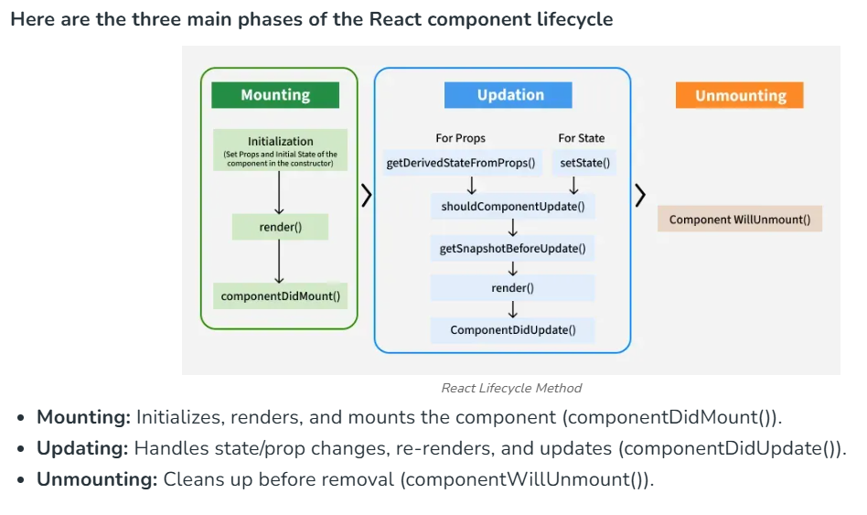
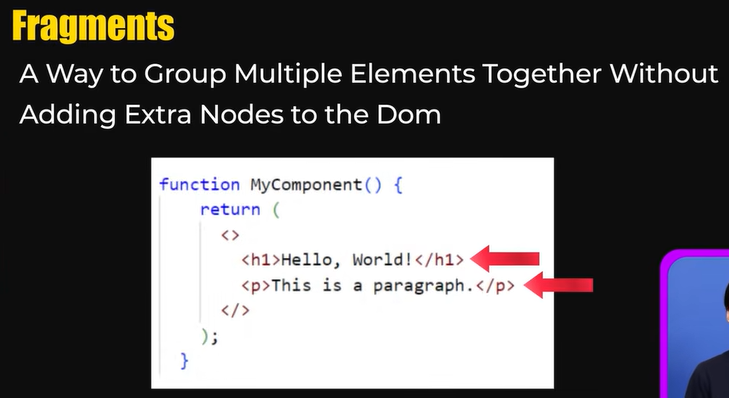

## 🔹 Topic:  Reactjs
- [ ] **Q1. What is React.js and Why it is so popular?**  
<details>
  <summary>Answer</summary> 

  **React** is an **open-source JavaScript library** used to build **user interfaces (UI)**, especially for **single-page applications (SPA)**.  
It was developed by **Facebook** and is widely used for creating **fast and interactive web apps**.

---

## ⭐ Key Features of React

| Feature                     | Description |
|-----------------------------|-------------|
| **1. Component-Based**       | UI is divided into small reusable components (like functions). Each component has its own logic and state. |
| **2. Virtual DOM**           | React creates a copy of the real DOM in memory and updates only the changed parts, which makes the app faster. |
| **3. JSX (JavaScript XML)**  | A syntax extension that lets you write HTML-like code in JavaScript. |
| **4. One-Way Data Binding**  | Data flows in one direction (from parent to child), making data flow easier to understand. |
| **5. Declarative UI**        | You just declare what the UI should look like, and React updates the UI when the data changes. |
| **6. React Hooks**           | Functions like `useState`, `useEffect` let you manage state and side effects without writing classes. |
| **7. Reusable Components**   | Build once and use anywhere in the app, saving time and effort. |
| **8. Strong Ecosystem**      | Supports libraries like Redux (state management), React Router (routing), and works well with backend APIs. |
| **9. Server-Side Rendering (SSR)** | With frameworks like **Next.js**, React can also render content on the server for better SEO. |
| **10. Mobile App Support**   | You can build mobile apps using **React Native**, based on the same React principles. |

---

## 🎯 Example Code

```jsx
function Welcome(props) {
  return <h1>Hello, {props.name}</h1>;
}
```

This is a **React component** that takes a name and displays it.  
Components like this are the building blocks of React apps.
</details>

---
- [ ] **Q2.  What is a Single Page Application (SPA),Advantage and Disadvantage ?**  
<details>
  <summary>Answer</summary> 

  

A **Single Page Application (SPA)** is a type of web application that loads a single HTML page and dynamically updates the content on the page as the user interacts with the app, without reloading the entire page from the server. SPAs use JavaScript frameworks like **React**, **Angular**, or **Vue** to handle routing and rendering on the client side.

---

## ✅ Advantages of Single Page Application

### 1. Fast User Experience
Only the required content is updated, so users experience faster navigation and response.

### 2. Less Server Load
Once the main page is loaded, most interactions happen via API calls (usually JSON), reducing the server workload.

### 3. Smooth Transitions
Navigation feels more like a desktop app — no full page reloads, resulting in a seamless experience.

 

---

## ❌ Disadvantages of Single Page Application

### 1. SEO Challenges
Since SPAs load content dynamically, search engines may have trouble indexing all content properly (although this is improving with SSR and pre-rendering).

### 2. Initial Load Time
The first load can be slower as the entire JavaScript bundle is downloaded before anything is displayed.

### 3. JavaScript Dependency
If JavaScript fails or is disabled, the app may not work at all.

### 4. Browser History Handling
Managing browser back/forward buttons and URLs can be more complex and requires manual routing logic.

### 5. Security Risks
More logic is exposed on the client side, which can lead to increased risk of XSS (Cross-Site Scripting) if not handled properly.

</details>

---
- [ ] **Q3.What is JSX?  ?**  
<details>
  <summary>Answer</summary> 
  JSX stands for JavaScript XML.

It lets you write HTML-like code inside JavaScript, mainly used in React to build user interfaces.

## Example

```
const name = "Himanshu";
const greeting = <h2>Hello, {name}</h2>;
```
</details>

---

- [ ] **Q4.How we write javascript inside jsx code  ?**  

<details>

  <summary>Answer</summary> 
  You can write JavaScript expressions inside JSX using curly braces {}.

  ## Example

  ```

  function greet(name) {
  return "Hello " + name;
}
return <h2>{greet("Himanshu")}</h2>;
```

# 🆚 Difference Between JSX and HTML

JSX looks like HTML but it's not exactly the same — it's a **JavaScript extension** used in **React** to describe the UI.

---

## 📊 Comparison Table

| Feature               | **HTML**                          | **JSX (React)**                        |
|-----------------------|-----------------------------------|----------------------------------------|
| **File Type**         | `.html`                           | `.jsx` or `.js`                        |
| **Syntax Type**       | Markup Language                   | JavaScript with HTML-like syntax       |
| **Class Attribute**   | `class`                           | `className`                            |
| **Inline Styles**     | `style="color:red"`               | `style={{ color: 'red' }}`             |
| **Event Handlers**    | `onclick="..."`                   | `onClick={...}`                        |
| **JavaScript Usage**  | Cannot write JS directly          | Can write JS using `{}`                |
| **Self-closing Tags** | Optional: `<br>`                  | Required: `<br />`                     |
| **Comments**          | `<!-- comment -->`                | `{/* comment */}`                      |

---

</details>

- [ ] **Q5. Functional Component and Class Component ?**  
<details>
  <summary>Answer</summary> 

## Definition of Functional Component in React
A Functional Component in React is a component defined using a JavaScript function.
It is simpler and shorter than class components,
uses Hooks like useState to manage state,
uses useEffect for lifecycle behavior,
and does not use the this keyword to access props or state


  ## Definition of Class Component in React
A Class Component in React is a component defined using the class keyword.
It must extend React.Component, can manage state using this.state,
can respond to lifecycle events like componentDidMount(), and uses this to access props and state.

  ## 🆚 Functional Components vs Class Components in React

| **Feature**          | **Functional Components**                                   | **Class Components**                                               |
|----------------------|-------------------------------------------------------------|--------------------------------------------------------------------|
| **State Management** | Can use Hooks like `useState`, `useReducer`                 | Uses `this.state` and `this.setState()`                            |
| **Lifecycle Methods**| Uses `useEffect` Hook for lifecycle methods                 | Uses traditional methods like `componentDidMount`, `componentWillUnmount` |
| **Rendering**        | Returns JSX directly inside the function                    | Uses a `render()` method to return JSX                            |
| **Performance**      | Faster and more lightweight due to simpler structure        | Slightly heavier due to class instance overhead                   |
| **Hooks**            | Can use React hooks (`useState`, `useEffect`, etc.)         | Cannot use hooks; uses lifecycle methods and state                |
| **`this` Keyword**   | Does not use `this` keyword                                 | Uses `this` to access props and state                             |
| **Code Complexity**  | Less boilerplate code, easier to write and understand       | More boilerplate code, especially for state and methods           |
| **Event Handling**   | Simple and direct event handling                            | Requires method binding for event handling                        |

</details>

---

- [ ] **Q5.What is the React Lifecycle  ?**  
<details>
  <summary>Answer</summary> 

  
The React lifecycle refers to the different phases a component goes through during its time in a React application. These phases allow you to run specific code at key moments in a component's life, such as when it’s created, updated, or removed from the screen


</details>

---

- [ ] **Q6. What is props in React?And how it is diff from state  ?**  
<details>
  <summary>Answer</summary> 
  
  In React, state and props are both used to manage data in components, but they serve different purposes. Props (short for properties) are used to pass data from a parent component to a child component. They are read-only, meaning the child component cannot modify the props it receives. This makes props useful for configuration and displaying external data.

On the other hand, state is used to store and manage data internally within a component. It allows a component to track information that can change over time, like user input, UI changes, or API responses. Unlike props, state is mutable, and it can be updated using functions like setState in class components or useState in functional components. In short, props are passed to a component, while state is managed and controlled by the component itself.


</details>

---
- [ ] **Q6.What Happens When a State Variable Changes in React  ?**  
<details>
  <summary>Answer</summary> 

  ## ✅ Steps

1. **State is updated**  
   The `setState` function (like `setCount`) is called to update the value.

2. **Component re-renders**  
   The entire component function runs again. This is an internal React re-render, not a full page reload.

3. **Virtual DOM is updated and compared**  
   React creates a new Virtual DOM and compares it with the previous one (diffing).

4. **Real DOM is updated**  
   React updates only the parts of the DOM that changed.

5. **`useEffect()` runs (if applicable)**  
   If the changed state is listed in the `useEffect` dependency array, the effect runs.

---

## ⚠️ Note

- ❌ **No full page reload** occurs.
- ✅ **Only the affected component (and possibly its children) re-renders.**

---
</details>

---

- [ ] **Q7. What is the key Attribute in React?  ?**  
<details>
  <summary>Answer</summary> 

  In React, the key attribute is used to uniquely identify elements in a list.
It helps React track which items have changed, been added, or removed, so it can efficiently update the UI.

```
const items = ['Apple', 'Banana', 'Orange'];

return (
  <ul>
    {items.map((item, index) => (
      <li key={index}>{item}</li>
    ))}
  </ul>
);

```
</details>

---

- [ ] **Q.What are fragments in react  ?**  
<details>
  <summary>Answer</summary> 

  
</details>

---

- [ ] **Q8.🌐 What is Virtual DOM?  ?**  
<details>
  <summary>Answer</summary> 
  
The Virtual DOM (VDOM) is a lightweight copy of the real DOM (Document Object Model).
It's a concept used by React to make web apps faster and more efficient.

Instead of updating the actual DOM directly (which is slow), React updates the Virtual DOM in memory, compares it to the previous version (diffing), and then makes only the necessary changes to the real DOM.
</details>

---

- [ ] **Q9.🌐 What is Virtual DOM  ?**  
<details>
  <summary>Answer</summary> 

  Reconciliation is the process React uses to update the DOM efficiently when the state or props change.

- When something changes in your app, React:

- Creates a new Virtual DOM based on the updated data.

- Compares it with the previous Virtual DOM (this is called diffing).

- Finds the differences between the old and new Virtual DOM.

- Updates only the changed parts in the real DOM, not the entire page.
</details>

---

- [ ] **Q10.# 🧠 Controlled vs Uncontrolled Components in React?**

<details>
  <summary>Answer</summary> 

In React, form elements like `<input>`, `<textarea>`, and `<select>` can be managed in two ways:

---

## 🔹 1. Controlled Component

### 1. Controlled Component
A controlled component is when React controls the input value using state.

The form element's value is bound to a state variable

You update the state using onChange

React always knows what's inside the input

### ✅ Example:
```jsx
import React, { useState } from 'react';

function ControlledInput() {
  const [text, setText] = useState("");

  return (
    <input
      type="text"
      value={text}
      onChange={(e) => setText(e.target.value)}
    />
  );
}
```
### Key Points:
- value={text} binds input to state

- React is in full control

- Easy to validate, reset, or manipulate 
--- 
## Uncontrolled Component
An Uncontrolled Component is a form element that manages its own value using the DOM.

React does not store or control the value.
You use a ref to access the input value when needed.

```
import React, { useRef } from 'react';

function UncontrolledInput() {
  const inputRef = useRef(null);

  const handleClick = () => {
    alert(inputRef.current.value);
  };

  return (
    <>
      <input type="text" ref={inputRef} />
      <button onClick={handleClick}>Show Value</button>
    </>
  );
}

```
📌 Key Points:
No state is used

Value is read directly from the DOM using ref

Less control over the input
</details>

---

- [ ] **Q11.What is Hooks in React?  ?**  
<details>
  <summary>Answer</summary> 
  Hooks are special functions in React that let you "hook into" React features like state, lifecycle, and context in functional components.

Before Hooks, these features were only available in class components, but now Hooks allow functional components to be just as powerful — and often simpler.

### ✅ Why Hooks?
- Add state and side-effects to functional components

- Make code simpler and cleaner

- Avoid the complexity of this, class syntax, and binding

## 📋 Common React Hooks and Their Purpose

| **Hook**         | **Purpose**                                                                 |
|------------------|------------------------------------------------------------------------------|
| `useState()`     | 👉 Lets you add **state** in a functional component                          |
| `useEffect()`    | 👉 Runs **side effects** (like API calls, timers, or DOM changes)            |
| `useRef()`       | 👉 Lets you access or store a **DOM element** or a **persistent value**      |
| `useContext()`   | 👉 Lets you access **global data** from a React Context                      |
| `useReducer()`   | 👉 Like `useState` but better for **complex state logic** (like Redux-style) |
| `useMemo()`      | 👉 **Memoizes** (remembers) expensive calculations to improve performance    |
| `useCallback()`  | 👉 **Memoizes a function** so it's not re-created on every render            |


</details>

---


- [ ] **Q12. What is useState() and why be not use normal variable instead of it ?**  
<details>
  <summary>Answer</summary> 
  useState() is a React hook that lets you create state in functional components.
It ensures the component re-renders when the state changes.

❌ A normal variable doesn’t trigger re-renders, so UI won’t update when its value changes.
✅ useState() keeps the value between renders and updates the UI correctly.
</details>

---

- [ ] **Q.12 What do you mean by prop drilling ?**  
<details>
  <summary>Answer</summary> 

  Prop drilling means passing data (props) from a parent component down to deep child components, even if some middle components don’t need the data — they just pass it along.
</details>


---

- [ ] **Q.What is the Children Prop Pattern  or Wrapper Component or Composition Pattern in React  ?**  
<details>
  <summary>Answer</summary> 

  The Children Prop Pattern is a way to build flexible and reusable components in React by using the special children prop to pass JSX content from a parent to a child component.

  ```js
  //app.js parent
  import React from 'react';
import Card from './Card';

function App() {
  return (
    <Card>
      <h1>Hello Himanshu</h1>
      <p>This content is passed as children.</p>
    </Card>
  );
}

  ```
  ```js
  import React from 'react';

function Card({ children }) {
  return (
    <div style={{ border: "1px solid gray", padding: "15px" }}>
      {children}
    </div>
  );
}

  ```
</details>

---

- [ ] **Q13.What is useeffct ? why to use and when to use? what if we not use it  ?**  
<details>
  <summary>Answer</summary> 

  # What is useEffect in React?

`useEffect` is a React Hook that lets you run side effects in a functional component — like:

- Fetching data from an API
- Setting up event listeners
- Working with timers
- Updating the DOM

## ✅ Why to Use useEffect?

React components only handle rendering.  
But sometimes you need to do things after rendering — like fetch data or interact with the browser.  
That's where `useEffect` is used.

## 📌 When to Use useEffect?

Use `useEffect` when:

- You want to fetch data on page load
- You need to run code when a component mounts or updates
- You want to clean up something when the component unmounts (like removing a timer or listener)

## 🔧 Example:

```jsx
import React, { useEffect, useState } from 'react';

function Example() {
  const [data, setData] = useState([]);

  useEffect(() => {
    // This runs after the component mounts
    fetch('https://api.example.com/data')
      .then(res => res.json())
      .then(data => setData(data));
  }, []); // empty dependency array = run once (on mount)

  return <div>{data.length} items loaded</div>;
}
```
What If You Don't Use useEffect?
- You won't be able to run code after rendering

- You can't fetch data, handle subscriptions, or interact with the browser APIs

- Your component will only render static content
</details>

---

- [ ] **Q.Why we write setinterval in useeffect while making counter  ?**  
<details>
  <summary>Answer</summary> 

  We write setInterval inside useEffect so that:

- It runs only once when the component mounts

- We can clean it up using clearInterval when the component unmounts

- It avoids creating multiple intervals on every re-render

- Without useEffect, setInterval would run on every render and speed of counter will increase because on every rendring a new setintervel is created, causing bugs and performance issues.
</details>

---

- [ ] **Q. What is useContext hook? And give example how it is used? ?**  
<details>
  <summary>Answer</summary> 
  The useContext hook is used to access data from a React Context inside a functional component — without passing props manually through every level of the component tree.

🧠 Yes — useContext is a parent-to-child data flow like props,
but it's cleaner, avoids prop drilling, and lets any nested component access data without passing it explicitly.

## Example
```js
// MessageContext.js
import { createContext } from 'react';
const MessageContext = createContext();
export default MessageContext;

```
```js
// App.js 
// parent component
import React, { useState } from 'react';
import MessageContext from './MessageContext';
import Child from './Child';

function App() {
    
  const [message, setMessage] = useState('');

  return (
    //value will we passed , it can be use in any child
    <MessageContext.Provider value={{ message, setMessage }}>
      <h2>Message from Child: {message}</h2>
      <Child />
    </MessageContext.Provider>
  );
}

export default App;

```
```js
// Child.js
import React, { useContext } from 'react';
import MessageContext from './MessageContext';

function Child() {

    //variable name should be same as it is passed in provider in parent
  const { message, setMessage } = useContext(MessageContext); // using both

  return (
    <div>
      <p>Child Received Message: {message}</p>
      <button onClick={() => setMessage('Hello Parent, from Child!')}>
        Send Message
      </button>
    </div>
  );
}

export default Child;

```
</details>

---

- [ ] **Q14.What are heigher order component  ?**  
<details>
  <summary>Answer</summary> 
</details>

---

- [ ] **Q. What is a React Portal  ?**  
<details>
  <summary>Answer</summary> 
</details>

---
- [ ] **Q.What is Link,navigate and routing in react  ?**  
<details>
  <summary>Answer</summary> 
  For usning Link and navigate first route should be defined
</details>

---
- [ ] **Q.What is react strict mode and how it help developer  ?**  
<details>
  <summary>Answer</summary> 
  React Strict Mode is a tool for highlighting potential problems in your React app during development.
It does not affect the production build — it’s purely for helping developers write better, safer code.
</details>

---